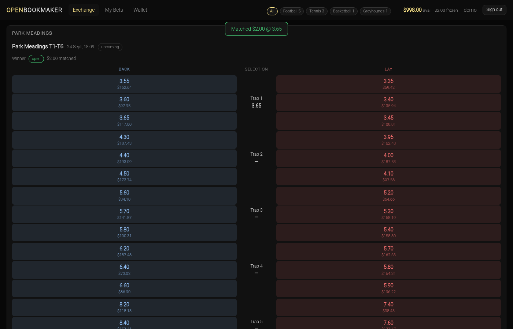

# OpenBookmaker

**An open-source, Betfair-style betting exchange** — back/lay order books with a
real matching engine, Betfair tick-ladder pricing, liability escrow, market
settlement with commission, cash-out, and seeded liquidity bots so the exchange
is always tradeable. Paper money only.



> ⚠️ **Paper money only.** Every balance is play money; there is no real-money
> path anywhere in this codebase. Operating a real-money betting exchange
> requires licensing and regulatory compliance (18+, responsible gambling,
> AML/KYC). Nothing here is financial, legal or gambling advice.

---

## What it does

- **A real order book per runner** — resting lay offers (what you can *back*
  into) and resting back offers (what you can *lay* into), aggregated by price
  level with displayed size. No house book; the exchange is the peers.
- **A matching engine** — best-for-taker sweeps, matches execute at the
  **resting order's price**, partial fills, the remainder rests, FIFO within a
  price level, and a user can never match their own order.
- **Escrow wallet** — a backer freezes their stake, a layer freezes
  `(price − 1) × stake`; available vs frozen balance with a full transaction
  ledger (`deposit / escrow / release / settle / commission / refund`).
- **Settlement with commission** — the admin settles a market with a winning
  runner (or voids it); the pot is distributed, commission is charged on **net
  winnings per user per market**, unmatched orders are auto-cancelled, and a
  settled market is frozen so it can never pay twice.
- **Cash-out** — close a single-runner position at top of book using the classic
  green-up math (the hedge stake scales as `1 / current price`), all-or-nothing.
- **Liquidity bots + drift** — a seeded `MarketMakers` bot quotes a three-tick
  spread around each runner's fair price, and a drift loop walks those fair
  prices so the board keeps moving. Both are configurable and can be turned off.
- **An admin trading desk** — create the catalogue, watch liquidity and matched
  volume, suspend/restore markets and settle them.
- **Live UI** — SSE pushes book changes; price cells flash green/red on a move.

---

## Quick start

```bash
npm install
cp .env.example .env      # optional — defaults work out of the box
npm run seed              # demo sports, events, users and bot liquidity
npm start                 # http://127.0.0.1:7777
```

Sign in with `demo` / `demo123` (customer) or `admin` / `admin123` (trading
desk). The faucet on the Wallet page tops up play money.

**The exchange binds to loopback only** — `HOST=0.0.0.0` is rejected at boot.

---

## Architecture

```
   browser (public/ — zero build, classic scripts, one global per file)
        │  REST + SSE (EventSource)                    ▲
        ▼                                              │ book / balance
  ┌──────────────────────────────────────────────────────────┐
  │ server.js — Express                                    │
  │   origin guard → sessions (httpOnly cookie) → routes    │
  │   lib/auth      scrypt + opaque session tokens          │
  │   lib/match     THE ENGINE: sweeps, fills, escrow      │
  │   lib/ledger    escrow/release/settle + transactions   │
  │   lib/settle    pot distribution, commission            │
  │   lib/cashout   green-up close                          │
  │   lib/odds      Betfair tick ladder, conversions        │
  │   lib/bots      MarketMakers ladders                    │
  │   lib/drift     fair-price random walk                  │
  │   lib/store     SQLite schema (node:sqlite, WAL)       │
  └──────────────────────────────────────────────────────────┘
        │
        ▼
  data/openbookmaker.db   (gitignored, created on first run)
```

**Design rules that the money depends on**

| Rule | Where |
| --- | --- |
| All money is integer **cents**; one `Math.round` per liability/payout/fee | `lib/match.js`, `lib/settle.js`, `lib/ledger.js` |
| A back freezes its stake; a lay freezes `(own price − 1) × stake` | `lib/match.js` |
| A lay matched at `P ≤ own price Q` releases `(Q − P) × fill` | `lib/match.js` |
| Back taker sweeps resting lays `Q ≥ P` **highest first**; lay taker sweeps rests `P ≤ Q` **lowest first**; match at the **resting** price | `lib/match.js` |
| Pot per match = `s + (Q−1)·s`; void refunds each side its own contribution | `lib/settle.js` |
| Commission only on net winnings, per user per market | `lib/settle.js` |
| Every service op is one transaction; ledger ops use `SAVEPOINT`s so they nest | `lib/ledger.js` |
| Cash-out hedge `= round(Σ sᵢ·eᵢ / n)` — divides by the **current** price | `lib/cashout.js` |

---

## Betting rules

- Stake between `MIN_STAKE_CENTS` (100 = $1) and `MAX_STAKE_CENTS`; the
  exchange escrows the stake (back) or the liability (lay) at placement.
- Prices snap to the **Betfair tick ladder** (`1.01–2.00` step `0.01` …
  `110–1000` step `10`); the server re-snaps everything it accepts.
- An order is a **limit order**: it matches immediately against eligible
  resting liquidity, and any unmatched remainder rests on the book until
  cancelled or settled.
- **Accumulators/parlays are not implemented** (v1 is one selection per order).
- Cash-out covers a single-runner, single-side position; multi-runner or mixed
  positions are traded manually.
- Markets can be suspended (orders rejected) and are frozen once settled.

---

## API

All endpoints are JSON and localhost-only. Errors are `{ "error": "..." }`.
Mutating requests require a loopback `Origin` (or no `Origin` for local
tooling). Authenticate with the `ob_session` httpOnly cookie or
`Authorization: Bearer <token>`.

### Public

| Method | Path | Purpose |
| --- | --- | --- |
| `POST` | `/api/auth/register` | Create an account (auto sign-in) |
| `POST` | `/api/auth/login` · `/api/auth/logout` | Session management |
| `GET` | `/api/me` | Current user + available balance |
| `GET` | `/api/sports` | Sports with open-event counts |
| `GET` | `/api/events?sport=slug` | Board: events → markets → runners + ladders |
| `GET` | `/api/markets/:id/book` | Full five-level ladder for a market |
| `POST` | `/api/orders` | Place an order `{selection_id, side, price, stake_cents}` |
| `GET` | `/api/orders` | Your unmatched (open) orders |
| `POST` | `/api/orders/:id/cancel` | Cancel the unmatched remainder |
| `GET` | `/api/positions` | Matched exposure, if-win P&L matrix, cash-out quote |
| `POST` | `/api/markets/:id/cashout` | Green-up close |
| `GET` | `/api/wallet` | Balance, escrow and the transaction ledger |
| `POST` | `/api/wallet/deposit` | Faucet top-up (capped by `FAUCET_MAX_CENTS`) |
| `GET` | `/api/settlements` | Settled history with P&L and commission |
| `GET` | `/api/stream` | SSE: `book`, `balance`, `orders`, `settlement` |

### Admin (role-gated)

| Method | Path | Purpose |
| --- | --- | --- |
| `POST` | `/api/admin/sports` | Create a sport |
| `POST` | `/api/admin/competitions` | Create a competition |
| `GET` | `/api/admin/competitions?sport_id=` | Competitions for a sport |
| `POST` | `/api/admin/events` | Create an event |
| `POST` | `/api/admin/markets` | Create a market |
| `POST` | `/api/admin/selections` | Create a runner (with a fair price → bots quote it) |
| `PATCH` | `/api/admin/markets/:id` | Suspend / restore |
| `POST` | `/api/admin/markets/:id/settle` | Settle: `{winner_selection_id}` or `{void: true}` |
| `GET` | `/api/admin/stats` | Matched volume and open orders per market |

---

## Configuration

`.env` (see `.env.example`); every value is validated at boot and a bad value
**aborts the launch** rather than failing later.

| Variable | Default | Meaning |
| --- | --- | --- |
| `PORT` / `HOST` | `7777` / `127.0.0.1` | Listener (loopback only) |
| `DB_PATH` | `data/openbookmaker.db` | SQLite file (`:memory:` for tests) |
| `COMMISSION_RATE` | `0.025` | Fee on net winnings per user per market |
| `FAUCET_MAX_CENTS` | `100000` | Faucet cap per deposit |
| `MIN_STAKE_CENTS` / `MAX_STAKE_CENTS` | `100` / `100000` | Order size limits |
| `BOT_ENABLED` | `true` | Quote liquidity with the MarketMakers bot |
| `DRIFT_ENABLED` / `DRIFT_INTERVAL_MS` | `true` / `5000` | Fair-price random walk |
| `SESSION_TTL_DAYS` | `30` | Session lifetime |

---

## Testing

```bash
npm test          # 78 offline unit + API-integration checks (8 suites)
npm run test:smoke  # 31 live end-to-end checks against a real server
npm run test:ui    # 22 real-browser checks (Playwright/Chromium)
```

Everything runs offline: temporary or in-memory databases, an ephemeral port,
and drift disabled. The suite covers the tick ladder, the matching sweeps and
FIFO, escrow release on a lay that matches better than its own price,
pot/void/commission settlement, conservation of money, cash-out green-up and
rollback, the HTTP surface, the origin/session guards, and the UI in a real
browser (including the ladder's geometry).

---

## Known limitations

- **Paper money only**, no real-money execution path, no payments, no KYC/AML.
- Accumulators (parlays) and each-way betting are not implemented.
- Cash-out is limited to single-runner, single-side positions.
- No in-play bet delay, no partial-fill queueing, no cross-market matching.
- Settlement is manual: an admin must settle each market (there is no results
  feed). Marked results are the only source of truth.
- The demo bot's fair prices are a random walk, not a model.
- Seeded credentials are committed on purpose for the demo; never deploy this
  as-is.

## License

MIT — see [LICENSE](LICENSE).
