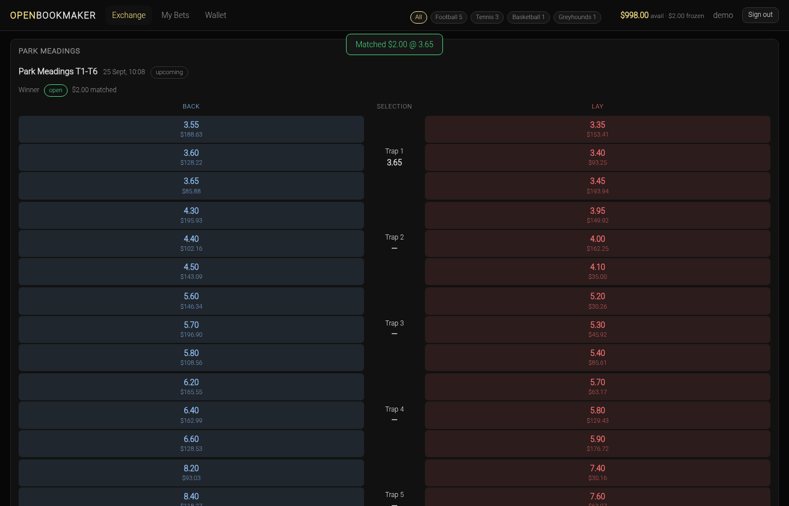

# OpenBookmaker

**An open-source betting exchange** — the kind of venue where the house is a
*fee*, not a book. Back and lay against other people, order books with real
depth, a matching engine with price-time priority, and settlement that pays the
pot.

Node 22 · Express · SQLite · zero-build frontend · **paper money only**.



> **Paper money only.** Every balance is play money and there is no real-money
> execution path, no payments and no withdrawals anywhere in this codebase.
> Running a real-money exchange requires licensing and regulatory compliance
> (18+, responsible gambling, AML/KYC). This is a self-hosted demo and a teaching
> project — see [`docs/EXCHANGE_RULES.md`](docs/EXCHANGE_RULES.md) for what it
> does and does not do.

## What makes it an exchange

A bookmaker sets the odds and takes the risk. An exchange does neither: **you
bet against other bettors**, and the exchange's only income is a commission on
winnings. That single difference changes the whole design, and this repo is
built around it:

- A **back** bet is "this runner wins" (risk: the stake). A **lay** bet is
  "this runner loses" (risk: `(price − 1) × stake`). The UI puts both on either
  side of every runner, exactly like the exchange you know.
- Orders are **limit orders** matched against a real order book with price-time
  priority, partial fills and a self-match guard. The displayed price is the
  **resting** order's price, not yours.
- Your risk is **escrowed** while a position is open — your balance shows
  available versus frozen.
- The **house edge is a commission on net winnings**, applied at settlement.
- Where a bookmaker protects itself with a spread, an exchange shows you the
  spread: here, the admin desk reports each market's **overround** (the
  arbitrage/margin signal) from the live book.

## 60-second tour

```bash
npm install
npm run seed      # demo catalogue, users and bot liquidity
npm start         # http://127.0.0.1:7777
```

1. Open the board: sports across the top, competition-grouped event cards, and a
   ladder per market — three back prices, the runner and its last traded price,
   three lay prices. Blue flashes are price rises, red are falls.
2. Sign in as `demo` / `demo123`, then **click a price**. The bet slip opens on
   the right with that side and price; adjust the stake or step the price along
   the ladder. Press **Place** — it matches against real liquidity or rests on
   the book.
3. **My Bets → Positions** shows what you are exposed to: per-runner backed and
   laid stakes, your escrow, and the if-this-wins P&L for every runner. A losing
   position on a winning runner can be **cashed out** at top of book.
4. **Wallet** shows available versus frozen, a faucet for play money, and every
   escrow, release, payout and commission as a ledger.
5. Sign in as `admin` / `admin123` for the **trading desk**: create the
   catalogue, read the live fair-price helper in American/fractional/implied
   form, watch matched volume and overround, suspend a market, and **settle** it
   with a winning runner (or void it) — which pays every matched pot net of
   commission, right then.

## What works today

| | Status |
| --- | --- |
| Back/lay order book, aggregated depth, LTP | working |
| Matching engine: best-for-taker sweeps, match at resting price, partial fills, FIFO, self-match guard | working |
| Escrow wallet: available vs frozen, full transaction ledger, faucet | working |
| Settlement: pot distribution, void refunds, commission on net winnings, auto-cancel, double-settle protection | working |
| Cash-out: green-up close at top of book, all-or-nothing | working (single runner, single side) |
| Liquidity bots + fair-price drift | working (disable with `BOT_ENABLED=false`) |
| Admin trading desk: catalogue, suspend/restore, settle, stats, overround | working |
| Live updates | working (SSE with a 15s poll fallback) |
| Accumulators / parlays | not implemented — see the rules doc |
| Each-way betting | not implemented |
| In-play bet delay, partial-fill queueing, results feed, real money | not implemented (out of scope) |

## Architecture

```
browser (public/ — plain HTML/CSS/classic JS, no build step)
     │  REST + SSE (EventSource), httpOnly cookie session
     ▼
┌───────────────────────────────────────────────────────────────────┐
│ server.js  origin guard → sessions → routes → JSON 404 → static │
│  lib/tx        transaction depth; nested calls use savepoints     │
│  lib/match     the engine: sweeps, fills, escrow, book, positions  │
│  lib/ledger    the only writer of balances and the transactions log │
│  lib/settle    pot distribution, commission, void, auto-cancel     │
│  lib/cashout   green-up close                                      │
│  lib/odds      tick ladder, American/fractional, implied, overround │
│  lib/auth      scrypt + opaque session tokens                      │
│  lib/bots      MarketMakers ladders        lib/drift  fair drift │
│  lib/store     schema (SQLite WAL)         lib/seed   fixtures    │
└───────────────────────────────────────────────────────────────────┘
     ▼
  data/openbookmaker.db   (created on first run, gitignored)
```

The dependencies run one way: `match → ledger → tx`, with `settle` and
`cashout` on top of `match`. There is no ORM, no migration tool, and no runtime
dependency beyond Express (Playwright is dev-only, for the browser suite) — the
data model is one readable SQL file of 13 tables. Read
[`docs/ARCHITECTURE.md`](docs/ARCHITECTURE.md) for the design and the reasoning.

## The rules that protect the money

If you read one thing before changing the engine, read this table. Every row is
asserted by a test.

| Rule | Why it exists | Tests |
| --- | --- | --- |
| Money is integer **cents**; one `Math.round` per liability, payout and fee | no drift, no two-round disagreements | `ledger`, `settle`, `store` |
| A back freezes its stake; a lay freezes `(price−1) × stake` at its own price | a layer's risk must be reserved before matching | `match` (E1) |
| A lay matched at `P ≤ own Q` releases `(Q−P) × fill` | the escrow must end up equal to what the match owes | `match` (E3, E5) |
| A back taker sweeps resting lays `Q ≥ P` highest-first; a lay taker sweeps rests `P ≤ Q` lowest-first | the taker gets the best available price | `match` (E4, E5) |
| Fills execute at the **resting** order's price | the resting orderer's price is the market's price | `match` (E1) |
| FIFO within a price level (`id` tiebreak) | price-time priority, not insertion luck | `match` (E13) |
| A user never matches their own order | no self-lay; own liquidity isn't executable | `match` (E6) |
| Pot per match is `s + (Q−1)·s`; the winner is credited the pot | settlement is zero-sum apart from commission | `settle` (S1–S3) |
| Void refunds each side its **own** contribution | nobody wins or loses on a void | `settle` (S4, S10) |
| Commission on **net winnings per user per market**, only if positive | mirrors the real-world model; never a fee on a loser | `settle` (S7) |
| A settled market is frozen and cannot settle twice | no double-pay | `settle` (S6), `api` |
| Cash-out hedge `= round(Σ sᵢ·eᵢ / n)` — divides by the **current** price | the hedge stake scales as `1/n`; entry-price maths is wrong | `cashout` (C1–C2) |
| Cash-out is all-or-nothing | never half-closed | `cashout` (C3) |
| Every money operation is one transaction (`lib/tx.js`) | a failure leaves no partial state | `tx` (X1–X6) |
| The database itself refuses invalid cents (`CHECK`) | the invariant does not rely on JavaScript | `store` (D3) |

Full specification, with worked examples: [`docs/EXCHANGE_RULES.md`](docs/EXCHANGE_RULES.md).

## API

JSON in, JSON out; errors are `{ "error": "..." }`. Mutating requests require a
loopback `Origin` (or none, for local tooling). Authenticate with the
`ob_session` httpOnly cookie, or `Authorization: Bearer <token>` for scripts.
Full reference including every parameter lives in
[`docs/API.md`](docs/API.md).

| Method | Path | Purpose |
| --- | --- | --- |
| `POST` | `/api/auth/register` · `/api/auth/login` · `/api/auth/logout` | account + session |
| `GET` | `/api/me` | you, your balance and escrow |
| `GET` | `/api/sports` · `/api/events` · `/api/markets/:id/book` | the board and the book |
| `POST` | `/api/orders` · `GET /api/orders` · `POST /api/orders/:id/cancel` | trade |
| `GET` | `/api/positions` | exposure, if-win P&L, cash-out quote |
| `POST` | `/api/markets/:id/cashout` | close a position |
| `GET` | `/api/wallet` · `POST /api/wallet/deposit` | balances + ledger |
| `GET` | `/api/settlements` | settled history |
| `GET` | `/api/format/:price` | decimal / American / fractional / implied |
| `GET` | `/api/stream` | SSE: `book`, `balance`, `orders`, `settlement` |
| `POST` | `/api/admin/{sports,competitions,events,markets,selections}` | build the catalogue |
| `GET` | `/api/admin/competitions?sport_id=` | competitions for a sport |
| `PATCH` | `/api/admin/markets/:id` | suspend / restore |
| `POST` | `/api/admin/markets/:id/settle` | settle: winner or `void: true` |
| `GET` | `/api/admin/stats` | matched volume, open orders, overround |

## Configuration

`.env` (see [`.env.example`](.env.example)). Every value is validated at boot;
a bad value **aborts the launch** rather than failing later.

| Variable | Default | Meaning |
| --- | --- | --- |
| `PORT` / `HOST` | `7777` / `127.0.0.1` | listener; `HOST` is loopback-only by design |
| `DB_PATH` | `data/openbookmaker.db` | SQLite file (`:memory:` for tests) |
| `COMMISSION_RATE` | `0.025` | fee on net winnings |
| `FAUCET_MAX_CENTS` | `100000` | faucet cap per deposit |
| `MIN_STAKE_CENTS` / `MAX_STAKE_CENTS` | `100` / `100000` | order size bounds |
| `BOT_ENABLED` / `DRIFT_ENABLED` | `true` | demo liquidity and price drift |
| `DRIFT_INTERVAL_MS` | `5000` | drift cadence |
| `SESSION_TTL_DAYS` | `30` | session lifetime |

## Development

```bash
npm test            # 96 checks, 11 suites — unit + API integration, fully offline
npm run test:smoke  # 33 checks — live end-to-end against a real server
npm run test:ui     # 24 checks — real Chromium via Playwright (board + admin desk)
```

The suite is dependency-free: plain `assert`, numbered examples, no framework,
no mocks. Tests use in-memory or temporary databases, an ephemeral port, and the
drift loop disabled, so `npm test` needs no credentials and no network. The
browser suite asserts the ladder's *geometry*, not just that cells exist — a
mis-stacked price column looks fine in a screenshot and fails an x/y assertion —
and drives the admin desk end to end.

Contributing, house conventions and where to add things:
[`CONTRIBUTING.md`](CONTRIBUTING.md). Security: [`.github/SECURITY.md`](.github/SECURITY.md).

## Project layout

```
lib/       engine and domain      server.js   HTTP + SSE wiring
public/    frontend (no build)     tests/      11 unit/API suites + smoke + browser
docs/      architecture, rules    data/       SQLite database (gitignored)
```

## Known limitations

Paper money only; no payments, KYC/AML or licensing path. Accumulators,
each-way betting, in-play bet delay, partial-fill queueing and a results feed
are out of scope. Settlement is a manual admin action, and the demo bot's fair
prices are a random walk, not a model. The seeded credentials are committed on
purpose for the demo — never deploy this as-is. Full list and rationale in
[`docs/EXCHANGE_RULES.md`](docs/EXCHANGE_RULES.md#what-is-deliberately-not-implemented).

## Roadmap

- Accumulators (parlays) and each-way markets
- In-play: bet delay modelling and a traded-volume ladder
- A cash-out that greens multi-runner positions
- A pluggable results feed that calls the same settlement entry point
- Odds-history charts and a market-mover view on the board

## Licence

MIT — see [`LICENSE`](LICENSE). © wippa-studios.
